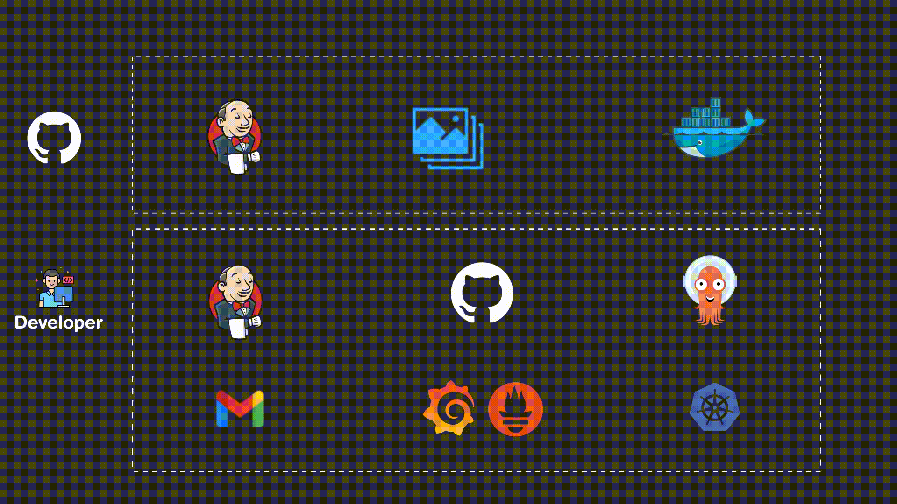
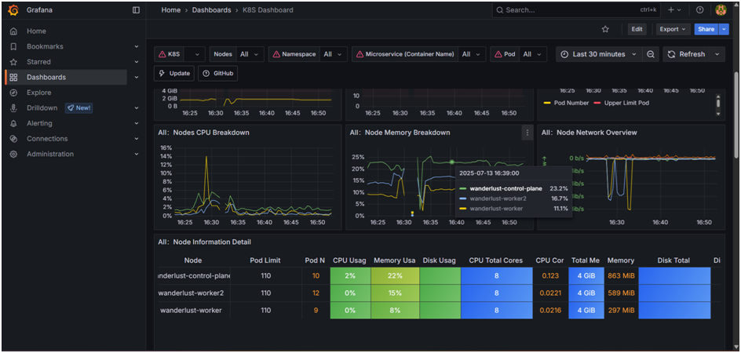
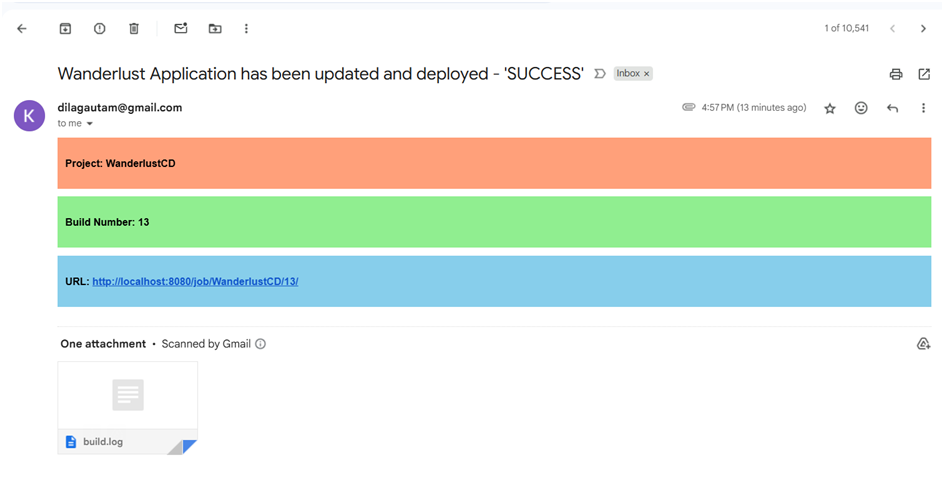

# 🚀 End-to-End DevOps Project: Deploying a 3-Tier MERN Stack App on Kind with CI/CD, GitOps & Monitoring

This project demonstrates how to deploy a complete **3-tier MERN stack application** on a **local Kubernetes cluster using Kind**, powered by a fully automated **CI/CD pipeline**, **GitOps with ArgoCD**, and **observability using Prometheus and Grafana**.

It covers everything from containerization and deployment to monitoring and notifications.

---

## 📽️ Project Deployment Flow

Here’s a short visual overview of the automated deployment process:

---

## 🧰 Tech Stack Used

- **Containerization**: Docker
- **Kubernetes**: Kind (Kubernetes in Docker)
- **CI/CD**: Jenkins (CI and CD Pipelines)
- **GitOps**: ArgoCD
- **Monitoring**: Prometheus + Grafana
- **Notifications**: Jenkins Email Plugin
- **Source Control**: GitHub

---

## 🔄 CI/CD Workflow

### ✅ CI Pipeline

- Triggered by **GitHub webhook** on code push.
- Builds Docker images for all 3 tiers.
- Tags each image using format `1.{BUILD_NUMBER}`.
- Pushes the images to **Docker Hub**.
- Triggers the CD pipeline with the new image tag.

### 🚀 CD Pipeline

- Updates Kubernetes deployment manifests with the new image tag.
- Pushes updated manifests to GitHub.
- Sends an **email notification** on successful deployment.

---

## 🚢 GitOps with ArgoCD

ArgoCD continuously monitors the GitHub repository containing the Kubernetes manifests.

- On every manifest update, ArgoCD syncs the app state with the **Kind cluster**.
- The new version of the app is automatically deployed—no manual steps required.

---

## 📈 Monitoring with Prometheus & Grafana

The deployed application and cluster performance are monitored using **Prometheus** and visualized in **Grafana** dashboards.

- Tracks CPU/memory usage
- Container health
- Request metrics
- Application uptime

📸 *Example Dashboard:*  

---

## 📬 Email Notification After Deployment

After a successful deployment, Jenkins sends an email notification with build and deployment details.

📧 *Sample Email:*  

---

## ⚙️ Pre-requisites to Implement This Project

To replicate this project locally, you’ll need:

- Docker
- Kind (Kubernetes in Docker)
- Jenkins installed with required plugins
- ArgoCD installed and configured
- Prometheus and Grafana setup in the cluster
- A working SMTP setup in Jenkins
- GitHub Webhook integration to trigger Jenkins CI jobs

---

## 📌 Summary

This project is a practical demonstration of deploying a 3-tier MERN application using a full DevOps toolchain locally on Kind. It highlights key practices like containerization, CI/CD automation, GitOps with ArgoCD, observability with Grafana, and notifications—making it ideal for real-world DevOps learning.

---

